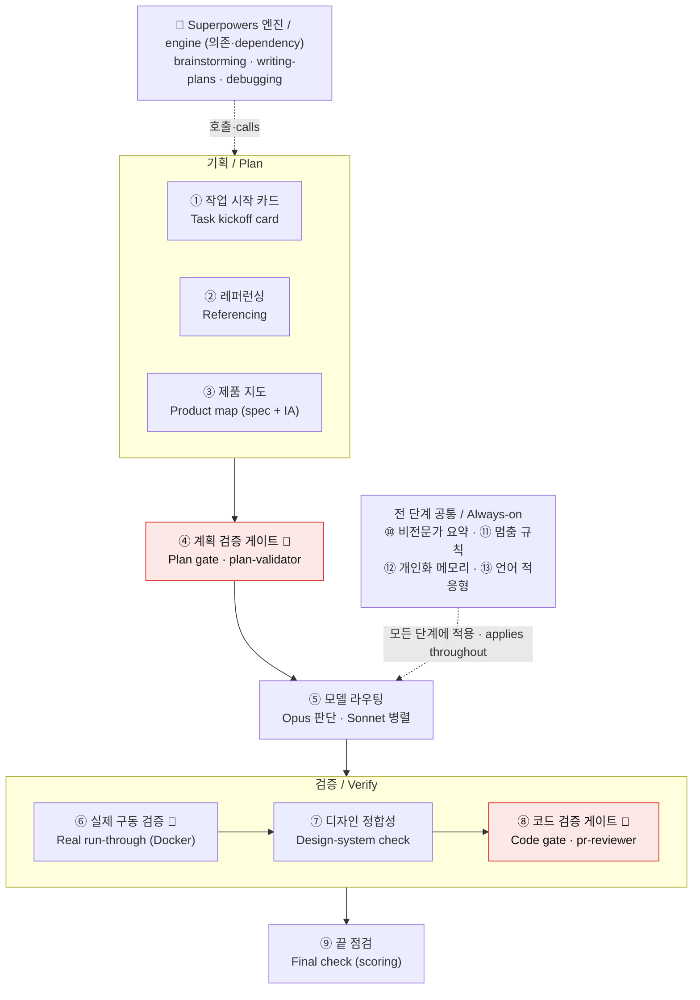

# 혼클로드 (honclwd)

**For solo builders & vibe coders — a Claude Code workflow that steadies the parts where solo building falls apart.**
**혼자 만드는 바이브 코더를 위한 Claude Code 워크플로우** — 혼자 만들 때 무너지기 쉬운 지점들을 받쳐줍니다.

It replies in your language (Korean or English) — even if you can't read code, safety gates and plain-language explanations have your back.
코드를 직접 읽지 못해도, 안전장치와 쉬운 설명(사용자 언어에 맞춰 — 한국어/영어)이 옆에서 받쳐줍니다.

→ [English](#english) · [한국어](#한국어)

---

## 핵심 기능 / Core features

honclwd는 Superpowers(brainstorming · writing-plans · debugging 등)를 **호출해 쓰고**, 그 위에 아래 ①~⑬을 더합니다. 기획 → 계획 → 구현 → 검증 → 마무리 흐름에 걸쳐 동작합니다.
*honclwd **calls** Superpowers (brainstorming · writing-plans · debugging …) and adds ①–⑬ on top, across the plan → build → verify → wrap-up flow.*



| # | 기능 | 무엇을 하나 / What it does |
|---|------|---------------------------|
| ① | **작업 시작 카드** · Task kickoff card | 착수 전에 목표·성공기준·범위를 합의 / agree on goal·success criteria·scope *before* building |
| ② | **레퍼런싱** · Referencing | 기획 중 경쟁사·사례를 조사해 "남들은→우리는"으로 방향 잡기 / competitor & case research to steady the direction |
| ③ | **제품 지도** · Product map | 기능 명세 + 화면 구조(IA)를 살아있는 문서로 유지 / a living feature spec + screen-structure (IA) map |
| ④ | **계획 검증 게이트** · Plan gate | 독립 적대 심판(plan-validator, Opus)이 **통과 못 하면 멈춤** / adversarial Opus judge that blocks until the plan passes |
| ⑤ | **모델 라우팅** · Model routing | 판단은 Opus, 기계적 작업은 Sonnet 병렬로 (느리고 비싼 "전부 Opus" 회피) / Opus for judgment, parallel Sonnet for mechanical work |
| ⑥ | **실제 구동 검증** · Real run-through | 화면을 격리 Docker에서 직접 눌러봄, **운영 쓰기는 차단** / clicks real screens in an isolated Docker env; production writes are hard-blocked |
| ⑦ | **디자인 정합성** · Design-system check | 새 화면이 색·컴포넌트·레이아웃 규칙과 맞는지 검증, 새 패턴은 등록 제안 / checks design rules, proposes registering new patterns |
| ⑧ | **코드 검증 게이트** · Code gate | PR 전 적대적 코드 검수(pr-reviewer, Opus) / adversarial code review before a PR |
| ⑨ | **끝 점검** · Final check | 성공기준으로 채점(자가점검 + 게이트 심판) / scores the result against the success criteria |
| ⑩ | **비전문가 요약** · Plain-language summary | 모든 기술 결과를 쉬운 말로(전 단계 공통) / every technical result explained simply |
| ⑪ | **멈춤 규칙** · Stop rules | 삭제·배포·비용·노출 같은 되돌리기 어려운 일 앞에서 멈춰 확인 / pauses before delete·deploy·cost·exposure |
| ⑫ | **개인화 메모리** · Personalized memory | 도메인·선호를 학습해 개인화(자격증명·시크릿은 저장 안 함) / learns your domain & preferences (never credentials/secrets) |
| ⑬ | **언어 적응형** · Language-adaptive | 사용자 언어로 응답(기본 한국어) / replies in your language (default Korean) |

---

## English

### Why honclwd

Built for people building alone. These days Claude writes the code — but when you actually try to ship something solo, three things tend to fall apart:

- **You're not sure *what* to build.** Without a clear direction the result wobbles. → honclwd strengthens the **planning stage** — reference research, a living feature spec, and a screen-structure (IA) map so the target stays steady.
- **Debugging drags on, and review is shaky.** Claude codes fast, but countless edge situations go uncontrolled and quality slips. → honclwd adds **step-by-step adversarial verification** (plan & code gates), and has Claude **actually click through the real screens in an isolated Docker environment** instead of just reading code.
- **The UI drifts.** Every time you add a button the design shifts a little. → honclwd checks new screens against your **design rules** (colors, components, layout) and proposes registering genuinely new patterns.

In short: Claude does the coding; honclwd keeps the *direction, the verification, and the consistency* from slipping. (See the [Core features](#핵심-기능--core-features) table above for the full ①–⑬ list.)

> Language-adaptive: the workflow replies in the language you use (defaults to Korean). The source content is Korean, but Claude reads it and answers you in your language.

### Requirements

- **Node.js** (required) — used by both Claude Code and honclwd. Check with `node -v`.
- **Docker Desktop** *(or local Supabase)* — recommended **only if** you want the real run-through test on an app with a backend/database. Claude clicks through your screens in this isolated environment so it never touches production data. Static / DB-less apps don't need it. honclwd does not auto-install Docker — install [Docker Desktop](https://www.docker.com/products/docker-desktop/) yourself.

### Install

```
/plugin marketplace add JasonKwak93/honclwd
/plugin install honclwd
```

The workflow turns on automatically when a new session starts — no config files to edit. If you don't see an activation notice at session start, see Troubleshooting.

### What gets installed with it (important)

This plugin uses the **Superpowers** methodology skills (brainstorming, planning, debugging, …) from the `claude-plugins-official` marketplace.
- Superpowers is **auto-installed as a dependency** (you don't install it separately).
- Auto-install works reliably on **recent Claude Code (v2.1.143+ recommended)**.
- **Manual install if auto-install didn't happen (in this order):**
  ```
  /plugin marketplace add claude-plugins-official
  /plugin install superpowers
  ```
  Install from the **same source (`claude-plugins-official`)** as honclwd's dependency so versions/marketplaces don't diverge.

### Troubleshooting

- **No activation notice / gates & skills don't run:** the workflow didn't turn on. ① Confirm Superpowers is installed (manual install above). ② This plugin uses `node` — check `node -v`. ③ For already-open sessions, run `/reload-plugins` or open a new session.

---

## 한국어

### 왜 만들었나

혼자 만드는 사람을 위해 만들었습니다. 요즘은 코딩을 Claude가 해주지만, 막상 혼자 무언가를 끝까지 만들어보면 세 군데서 무너집니다:

- **"뭘 만들지"가 흔들린다.** 방향이 명확하지 않으니 결과물도 갈팡질팡하죠. → honclwd는 **기획 단계를 보강**합니다 — 레퍼런스 조사, 살아있는 기능 명세, 화면 구조(IA) 정리로 목표가 흔들리지 않게 잡아줍니다.
- **디버깅이 끝이 없고, 검수가 허술하다.** Claude가 코딩은 빨리 해도 수많은 변수 상황을 다 통제하지 못해 품질이 떨어집니다. → 계획과 코드를 **단계별로 적대적으로 검증**하고, 코드만 읽고 끝내는 게 아니라 Claude가 **실제 화면을 격리된 Docker 환경에서 직접 눌러가며** 테스트합니다.
- **화면이 점점 따로 논다.** 버튼 하나 추가할 때마다 디자인이 미묘하게 달라지는 그 현상. → 새 화면이 **디자인 규칙**(색·컴포넌트·레이아웃)과 맞는지 검증하고, 진짜 새로운 패턴은 규칙으로 등록을 제안합니다.

한마디로: 코딩은 Claude가, **방향·검증·일관성이 흐트러지지 않게** 잡아주는 건 honclwd가. (전체 ①~⑬ 기능은 위 [핵심 기능](#핵심-기능--core-features) 표를 보세요.)

> 언어 적응형: 워크플로우는 사용자가 쓰는 언어로 응답합니다(기본 한국어). 소스는 한국어지만 Claude가 읽고 사용자 언어로 답합니다.

### 준비물

- **Node.js** (필수) — Claude Code와 honclwd 둘 다 사용합니다. `node -v`로 확인.
- **Docker Desktop** *(또는 로컬 Supabase)* — 백엔드/DB가 있는 앱을 **실제 구동 검증**으로 테스트할 때만 권장합니다. Claude가 이 격리된 환경에서 화면을 눌러보므로 운영 데이터를 절대 건드리지 않습니다. 정적·DB 없는 앱은 필요 없습니다. honclwd가 Docker를 자동설치하지는 않으니 [Docker Desktop](https://www.docker.com/products/docker-desktop/)을 직접 설치하세요.

### 설치

```
/plugin marketplace add JasonKwak93/honclwd
/plugin install honclwd
```

설치하면 **새 세션이 시작될 때 워크플로우가 자동으로 켜집니다.** 따로 설정 파일을 편집할 필요가 없습니다. (세션 시작 시 활성 안내가 안 보이면 아래 "문제 해결"을 보세요.)

### 함께 설치되는 것 (중요)

이 플러그인은 `claude-plugins-official` 마켓플레이스의 **Superpowers** 방법론 스킬(아이디어 정리·계획·디버깅 등)을 사용합니다.
- Superpowers는 **의존성으로 자동 설치**됩니다(직접 따로 설치하지 않아도 됩니다).
- **Claude Code 최신 버전(권장 v2.1.143 이상)** 에서 자동 설치가 안정적으로 동작합니다.
- **자동 설치가 안 됐을 때 수동 설치(이 순서 그대로):**
  ```
  /plugin marketplace add claude-plugins-official
  /plugin install superpowers
  ```
  honclwd의 의존성과 **같은 출처(`claude-plugins-official`)**에서 설치해야 버전·마켓플레이스가 어긋나지 않습니다.

### 문제 해결

- **세션 시작 안내가 안 보인다 / 게이트·스킬이 안 돈다:** 워크플로우가 안 켜진 것입니다. ① Superpowers 설치 확인(위 수동 설치) ② 이 플러그인은 `node`를 쓰므로 `node -v`로 node 설치 확인 ③ 이미 열린 세션은 `/reload-plugins` 하거나 새 세션을 연다.

---

## 구성 / Components

- `rules/operating-rules.md` — 워크플로우 본체(세션 시작 시 자동 적용) / workflow core (auto-applied at session start)
- `skills/referencing/SKILL.md` — 기획 중 레퍼런스 조사 / reference research during planning
- `skills/product-map/SKILL.md` — 기능 명세·IA 구조 정리/갱신 / living feature spec & IA
- `skills/design-system/SKILL.md` — 디자인 규칙 검증·갱신 / design-rule checks & updates
- `agents/plan-validator.md` — 계획 검수 게이트 / plan review gate
- `agents/pr-reviewer.md` — 코드 검수 게이트 / code review gate
- `agents/code-implementer.md` — 단순·기계적 코드 구현 담당 / mechanical implementation worker

## 라이선스 / License

MIT
