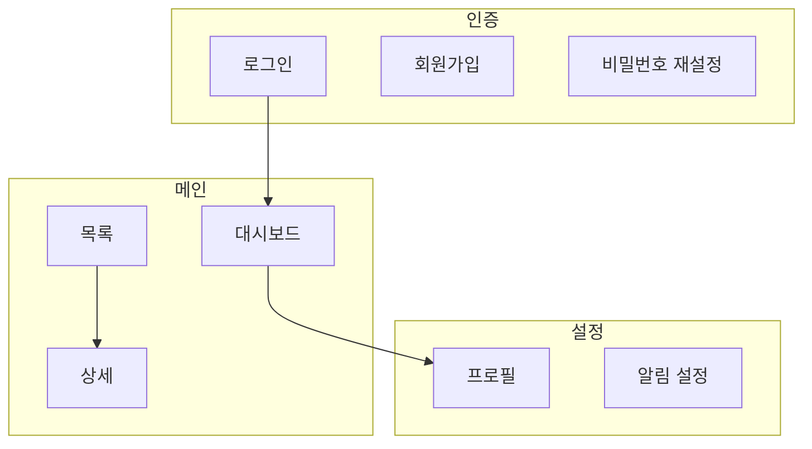

# 제품 지도

제품의 기능과 화면 구조를 한 곳에 모아 두어, 브레인스토밍·계획·구현의 모든 단계에서 같은 기준으로 참조하고 갱신한다. 지도가 최신 상태를 유지하면 기능 누락·이름 불일치·화면 중복 같은 혼선을 방지할 수 있다.

---

## 산출물 ① 기능 명세 (docs/feature-spec.md)

기능을 한 줄씩 정의하는 가벼운 기능정의서다. 단일 마크다운 테이블로 관리하며, 기능이 생기거나 상태가 바뀌면 해당 행만 추가·수정한다.

**컬럼 고정(8개):**

| ID | 기능명 | 설명 | 사용자 | 우선순위 | 상태 | 관련 화면 | 비고 |
|----|--------|------|--------|----------|------|-----------|------|
| F-01 | 회원가입 | 이메일·비밀번호로 신규 계정 생성 | 비로그인 사용자 | 높음 | 완료 | 인증/회원가입 | 이메일 인증 포함 |
| F-02 | 대시보드 요약 | 핵심 지표를 한눈에 표시 | 로그인 사용자 | 높음 | 개발중 | 대시보드 | 차트 라이브러리 검토 중 |
| F-03 | 알림 설정 | 수신 채널·빈도 선택 | 로그인 사용자 | 낮음 | 기획중 | 설정/알림 | — |

**상태 허용값:** `기획중` / `개발중` / `완료` / `보류`

**우선순위 허용값:** `높음` / `중간` / `낮음`

**ID 형식:** `F-01`, `F-02`, `F-03` …

### 검증 체크리스트 (표 아래에, F-id별)

8컬럼 표는 그대로 두고, 표 **아래에** 각 기능의 "작동한다"를 확인하는 pass 조건을 F-id별 섹션으로 둔다. 이게 빌드 검증(끝 점검)·운영 점검의 단일 출처다. 예:

```
### F-03 알림 설정 — 검증 체크리스트  [정기 점검 대상]
- [ ] 진입: 로그인 → 설정 → 알림 설정 도달 (IA 연결)
- [ ] 동작: 채널 선택·저장
- [ ] 영향: 저장이 알림 목록/대시보드에 반영 (IA 연결)
```

- **IA 연결 인지:** 체크리스트는 그 기능 노드의 **IA 1-hop 연결만** 포함한다 — ① 진입 경로(상류: 어떻게 도달하나) ② 직접 영향(하류·옆: 저장이 반영되는 연결 화면). **전체 그래프 추적 금지(1-hop까지만).**
- **미검증 연결:** IA에서 `%% 연결 미확정`·점선인 연결은 항목에 `(미검증)`을 붙이고 맹신하지 않는다(노드 표기와 같은 용어).
- **`[정기 점검 대상]`** 표시는 우선순위 높은 기능에만(작게 — pass 조건 몇 개).

---

## 산출물 ② IA 구조 (docs/ia-structure.md)

Mermaid 기반 확장형 구조도다. 제품 규모에 따라 아래 4구역 중 필요한 것만 작성한다.

> **화면 없는 제품은 IA를 만들지 않는다.** CLI 도구·플러그인·라이브러리·API처럼 사용자 화면(UI)이 없는 제품은 그릴 화면이 없으므로 `docs/ia-structure.md`를 생성하지 않고 **기능 명세(①)만** 관리한다. 이 경우 feature-spec의 "관련 화면" 칸은 `화면 없음`으로 적는다.

### 0. 갱신 규칙(절대 변경 금지)

- 한 다이어그램은 **노드 15개 이하**. 넘으면 영역별로 분할한다.
- 영역은 `### 영역: <이름>` 섹션 하나로 표현(새 영역이 생기면 섹션만 추가).
- 노드 ID는 `영역_화면` 형식(예 `auth_login`, `auth_signup`). 상위 지도와 하위 상세에서 **같은 화면은 같은 ID**를 쓴다.
- subgraph끼리 화살표로 이을 때 subgraph 내부 방향을 따로 지정하지 않는다(부모 `flowchart TD` 방향을 상속 — 방향 지정 시 깨지는 알려진 함정 회피).
- 순수 계층 구조는 `mindmap`, 화면 이동 흐름은 `flowchart TD`를 쓴다.

### 1. 한눈에 보기

- **소규모 제품:** 단일 `flowchart TD` + subgraph로 영역을 구분한다.
- **대규모 제품:** 영역 이름만 담은 상위 지도를 작성하고, 각 영역의 상세는 아래 2에서 관리한다.

**소규모 예시:**



### 2. 영역별 상세

제품이 커져서 한 영역이 15노드를 넘기 시작하면, 해당 영역을 이 섹션의 독립 섹션으로 분리한다. 영역마다 `### 영역: <이름>` + `flowchart TD`(노드 ≤15)로 작성한다.

### 3. 화면 흐름(선택)

사용자 여정이 복잡할 때만 시나리오별 `flowchart TD`를 추가한다.

**확장 트리거:**

| 제품 규모 | 작성 범위 |
|-----------|-----------|
| 소규모 | 1구역만 작성 |
| 중규모(한 영역이 15노드 초과) | 1을 상위 지도로 바꾸고, 해당 영역을 2에 분리 섹션으로 추가 |
| 대규모 | 모든 영역을 2에 독립 섹션으로 작성, 필요 시 3도 추가 |

---

## 산출물 ③ 레퍼런스 근거 (docs/references/YYYY-MM-DD-<주제>.md)

referencing 스킬이 만든 조사 근거 파일이 이 폴더에 날짜순으로 쌓인다.

- **파일명 형식:** `YYYY-MM-DD-<주제>.md` (예: `2026-06-01-경쟁사-분석.md`)
- `docs/references/` 폴더는 referencing 또는 product-map 실행 시 없으면 자동으로 만든다.

---

## 참조(읽기)

브레인스토밍·계획·구현 **각 단계 시작 시** 다음 두 파일을 읽어 기존 제품 맥락을 파악하고 새 작업을 일관되게 이어간다.

- `docs/feature-spec.md` — 기존 기능 목록·상태 확인
- `docs/ia-structure.md` — 화면 구조·노드 ID 확인 (화면 없는 제품은 이 파일이 없는 게 정상)

파일이 없으면 "제품 지도부터 만들까요?"라고 제안한다. 단 화면 없는 제품이면 IA는 빼고 기능 명세만 제안한다.

> **모노레포·다중 제품 레포 주의.** 한 레포에 여러 제품/패키지가 있으면 루트 단일 지도는 무의미하거나 흩어진다. 이 경우 고정 루트 `docs/`가 아니라 **현재 작업 중인 패키지/제품 범위의 `docs/`**(예: `packages/<제품>/docs/`)를 읽고, 지도 위치를 사용자에게 한 번 확인한다. IA 노드 ID는 제품 접두사를 붙여(예: `appA_auth_login`) 제품 간 같은 화면명 충돌을 막는다.

---

## 지도가 없을 때 (중간 투입 / brownfield)

feature-spec이나 IA가 없으면 한쪽을 강행하지 말고 사용자에게 선택지를 제시한다.

> 이 프로젝트엔 제품 지도가 아직 없네요. 어떻게 할까요?
> **① 전체 부트스트랩 (추천)** — 지금 코드를 스캔해 기능 명세·화면 구조 뼈대 초안을 만듭니다. 프로젝트가 크면 시간이 좀 걸릴 수 있어요.
> **② 점진** — 지금 건드리는 기능·화면만 그때그때 채웁니다(빠르게 시작).

추천은 **①**(연결 정확도가 높음), 시간 경고를 함께 보여준다. 화면 없는 제품이면 IA는 빼고 feature-spec만(기존 분기 유지).

### ① 전체 부트스트랩 절차

- 코드에서 라우트·페이지·컴포넌트·내비게이션을 스캔해 기능 목록·화면 목록을 뽑는다(라우터 정의·페이지 폴더·링크). **best-effort — 완벽 추출이 아니며 빠진 곳은 사용자가 채운다.**
- feature-spec: 추출 기능을 8컬럼 표 행으로(기존 기능은 상태 `완료`), **`비고` 칸에 `초안(부트스트랩)`** 표기.
- ia-structure: 추출 화면을 노드로, **코드 라우팅에서 확인된 연결만 실선**. 확인 안 된 연결은 **점선(`-.->`) + `%% 연결 미확정` 주석**, 추출 노드 라벨에 필요 시 `(미검증)` 병기.
- 코드를 스캔하는 김에 눈에 띄는 **구조적 이상**(끊긴 링크·고아 화면·막다른 화면·중복 기능·코드와 명세 불일치)도 함께 수집한다. 단, 지도에는 섞지 말고 아래 `## 지도화 중 발견된 의심`으로 따로 모은다.
- 완료 후 "초안입니다 — 빠지거나 틀린 곳을 알려주세요"라고 사용자에게 확인 요청.

### ② 점진 + 가드 3개

가드의 주체는 **Claude**다 — 매번 사용자에게 떠넘기지 말고 Claude가 코드를 읽어 확인·표기한다.

- 지금 건드리는 기능·화면만 추가한다.
- **가드1(연결은 코드로):** 화면 연결은 추측하지 말고 Claude가 코드의 라우팅/내비게이션을 읽어 확인해 긋는다. 확인 안 되면 긋지 말고 점선+`%% 연결 미확정`.
- **가드2(미검증 표기):** 점진/부트스트랩으로 채운 행은 feature-spec `비고`에 `점진·미검증`, IA 노드·연결도 미검증 표기.
- **가드3(① 승격):** 점진 지도가 커지거나 연결이 헷갈리면 ① 전체 부트스트랩으로 코드와 대조·정정.
- **대원칙:** 지도는 코드보다 윗권위가 아니다 — 연결이 의심되면 **코드가 진실의 원천**이다.
- 점진으로 코드를 읽는 김에도 구조적 이상이 보이면 아래 `## 지도화 중 발견된 의심`으로 따로 모은다(지도엔 안 섞음).

---

## 지도화 중 발견된 의심

지도를 그리려 코드를 어차피 읽으니, 그때 눈에 띈 **구조적 이상**을 곁다리로 보고한다. 지도(feature-spec·ia-structure)는 **더럽히지 않고** 별도로 모은다.

**보고하는 것 (구조·연결 이상):**
- 끊긴 링크 — 가는 곳이 없는 버튼/링크
- 고아 화면 — 아무 데서도 도달할 수 없는 화면
- 막다른 화면 — 들어가면 빠져나올 길이 없는 화면
- 중복 기능 — 같은 일을 하는 화면/기능이 둘 이상
- 코드-의도 불일치 — 명세엔 있는데 코드엔 없음(또는 그 반대)

**못 잡는 것 (범위 밖 — 과신 금지):** 계산 오류·경계값·동시성·권한 누락 같은 **로직 버그는 지도를 그려봐선 모른다.** 그건 `실제 구동 검증`(돌려보기)·`pr-reviewer`(코드 검수)가 잡는다. 이건 버그 전수검사가 아니라 "지도화에 공짜로 딸려오는 구조 점검(structural lint)"이다.

**방식:**
- 별도로 `🔎 지도화 중 발견된 의심 N건`으로 보고한다. **차단하지 않음 · best-effort.**
- 각 건은 **"확인 필요"**로 표시한다 — 오탐 가능(예: 고아 화면이 의도된 것일 수 있음).
- 각 건마다 사용자에게 3택: **무시 / `systematic-debugging`으로 파보기 / 백로그**(백로그로 고른 건만 feature-spec `비고`나 메모로 남김).
- **이상이 0건이면** "구조 이상 없음"이라고 한 줄 보고한다.
- **절제:** 인라인으로 간결히. 목록이 길면 파일로 부풀리지 말고 요약 + "자세히 볼까요?"로 묻는다.

---

## 드리프트 점검 (지도 신선도)

시간이 지나며 지도(feature-spec·IA)가 코드와 어긋나는 것(드리프트)을 명시적으로 잡는다. 위 "지도화 중 발견된 의심"이 *지도를 그릴 때 곁다리로* 보는 거라면, 드리프트 점검은 *명시적으로 불러* 코드 현재 상태와 지도를 대조한다 — **같은 스캔·구조점검 기계를 재사용하며 중복 보고하지 않는다.**

**언제 도나**
- **온디맨드(전체):** 사용자가 "지도 신선한지 봐줘 / 드리프트 점검 / 지도랑 코드 맞나"라고 할 때 전체 대조.
- **끝 점검(범위 한정):** 기능 완료 시 방금 건드린 기능 + 그 IA 1-hop만 가볍게(끝 점검이 이미 하는 그 체크가 곧 가벼운 드리프트 점검이다). 전체 그래프는 온디맨드로.
- **자동 매일 점검 안 함:** 구조/외형 점검이라 `monitoring`(매일)엔 넣지 않는다(design 채점과 같은 이유 — 빌드/요청 시에만).

**무엇을 보나 (3종 델타)**
- **유령** (지도엔 있는데 코드엔 없음): feature-spec 행·IA 노드에 있는데 코드(라우트·페이지·기능)에서 안 보임.
- **누락** (코드엔 있는데 지도엔 없음): 코드 스캔에서 나온 화면·기능이 지도에 없음.
- **연결 어긋남**: IA 엣지(화면 이동)가 코드 라우팅/내비와 불일치(코드엔 없는 연결, 또는 코드엔 있는데 지도에 빠진 연결).

**어떻게**
- 코드에서 라우트·페이지·내비를 스캔(부트스트랩과 같은 방식)해 현재 목록을 뽑고 feature-spec 행·IA 노드/엣지와 대조한다. **best-effort — 완벽 추출이 아니다.**
- 각 델타는 **"확인 필요"**로 표시한다(오탐 가능 — 의도된 차이일 수 있음). 이는 구조 대조이지 로직 버그 전수검사가 아니다(로직 버그는 `실제 구동 검증`·`pr-reviewer`가 잡는다).
- 화면 없는 제품(IA 없음)은 feature-spec 델타만 본다.

**해결 (자동 수정 금지 — 자산 보존)**
각 델타마다 사용자에게 선택지를 제시한다. **사용자가 고르기 전 지도를 건드리지 않는다.**
- **지도 갱신** — 코드에 맞춰 feature-spec/IA를 고친다("코드가 진실의 원천").
- **코드가 틀림 → 백로그** — 지도가 의도·계획이고 코드가 덜 따라온 경우. feature-spec `비고`나 메모로 남긴다.
- **의도된 차이 → 무시** — 곧 지울 실험 코드 등.
- **(버그 의심이면) 파보기 → `systematic-debugging`** — 단순 누락이 아니라 코드가 잘못 동작하는 것으로 의심되면 파본다(🔎 "지도화 중 발견된 의심"과 같은 선택지 — 경로가 달라도 출구는 동일).

**보고**
`🧭 드리프트 N건(유령 a · 누락 b · 연결 c)`으로 요약하고 비개발자가 알아보게 풀어 적는다. 0건이면 "지도와 코드가 일치합니다" 한 줄. 목록이 길면 파일로 부풀리지 말고 요약 + "자세히 볼까요?"로 묻는다.
**중복 출력 금지:** "지도화 중 발견된 의심"의 "코드-의도 불일치"와 드리프트의 유령·누락은 같은 발견이다. **드리프트 점검으로 명시 호출되면 그 발견을 🧭(드리프트) 헤더로만 내고 🔎(의심)으로 다시 내지 않는다**(둘은 같은 기계, 헤더만 다름).

---

## 갱신(쓰기)

다음 두 시점에 지도를 갱신한다.

1. **기능 완료(끝 점검) 시 자동으로** — 완료된 기능의 `상태`를 `완료`로 변경하고, 새로 생긴 화면이 있으면 IA에 노드를 추가한다.
2. **사용자 요청 시** — 명시적으로 갱신을 요청할 때 즉시 반영한다.
3. **끝 점검 채점에서 ✅ 된 기능과 함께 갱신한다** — 채점 결과를 feature-spec 상태(완료)에 반영하고, 새 화면은 IA에 추가한다.
4. **검증 체크리스트도 저장/갱신** — 기능 완료 시 그 기능의 검증 체크리스트(IA 1-hop 연결 포함)를 저장하거나 변경분 위주로 갱신한다.

**원칙: 변경분 위주로 간결하게.** 전체 파일을 재작성하지 않는다. 바뀐 행(feature-spec) 또는 바뀐 노드(ia-structure)만 추가·수정한다.
