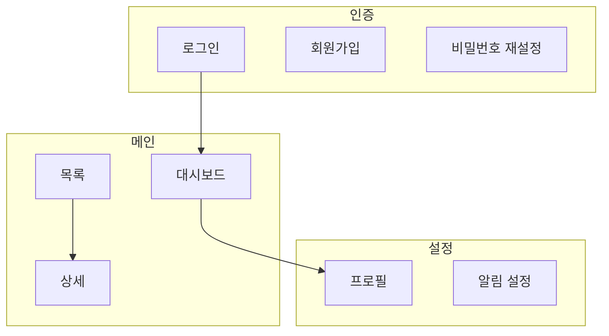

# 제품 지도

제품의 기능과 화면 구조를 한 곳에 모아 두어, 브레인스토밍·계획·구현의 모든 단계에서 같은 기준으로 참조하고 갱신한다. 지도가 최신 상태를 유지하면 기능 누락·이름 불일치·화면 중복 같은 혼선을 방지할 수 있다.

---

## 산출물 ① 기능 명세 (docs/feature-spec.md)

기능을 한 줄씩 정의하는 가벼운 기능정의서다. 단일 마크다운 테이블로 관리하며, 기능이 생기거나 상태가 바뀌면 해당 행만 추가·수정한다.

**컬럼 고정(8개):**

| ID | 기능명 | 설명 | 사용자 | 우선순위 | 상태 | 관련 화면 | 비고 |
|----|--------|------|--------|----------|------|-----------|------|
| F-01 | 회원가입 | 이메일·비밀번호로 신규 계정 생성 | 비로그인 사용자 | 높음 | 완료 | 인증/회원가입 | 이메일 인증 포함 |
| F-02 | 대시보드 요약 | 핵심 지표를 한눈에 표시 | 로그인 사용자 | 높음 | 개발중 | 대시보드 | 차트 라이브러리 검토 중 |
| F-03 | 알림 설정 | 수신 채널·빈도 선택 | 로그인 사용자 | 낮음 | 기획중 | 설정/알림 | — |

**상태 허용값:** `기획중` / `개발중` / `완료` / `보류`

**우선순위 허용값:** `높음` / `중간` / `낮음`

**ID 형식:** `F-01`, `F-02`, `F-03` …

---

## 산출물 ② IA 구조 (docs/ia-structure.md)

Mermaid 기반 확장형 구조도다. 제품 규모에 따라 아래 4구역 중 필요한 것만 작성한다.

> **화면 없는 제품은 IA를 만들지 않는다.** CLI 도구·플러그인·라이브러리·API처럼 사용자 화면(UI)이 없는 제품은 그릴 화면이 없으므로 `docs/ia-structure.md`를 생성하지 않고 **기능 명세(①)만** 관리한다. 이 경우 feature-spec의 "관련 화면" 칸은 `화면 없음`으로 적는다.

### 0. 갱신 규칙(절대 변경 금지)

- 한 다이어그램은 **노드 15개 이하**. 넘으면 영역별로 분할한다.
- 영역은 `### 영역: <이름>` 섹션 하나로 표현(새 영역이 생기면 섹션만 추가).
- 노드 ID는 `영역_화면` 형식(예 `auth_login`, `auth_signup`). 상위 지도와 하위 상세에서 **같은 화면은 같은 ID**를 쓴다.
- subgraph끼리 화살표로 이을 때 subgraph 내부 방향을 따로 지정하지 않는다(부모 `flowchart TD` 방향을 상속 — 방향 지정 시 깨지는 알려진 함정 회피).
- 순수 계층 구조는 `mindmap`, 화면 이동 흐름은 `flowchart TD`를 쓴다.

### 1. 한눈에 보기

- **소규모 제품:** 단일 `flowchart TD` + subgraph로 영역을 구분한다.
- **대규모 제품:** 영역 이름만 담은 상위 지도를 작성하고, 각 영역의 상세는 아래 2에서 관리한다.

**소규모 예시:**

### 2. 영역별 상세

제품이 커져서 한 영역이 15노드를 넘기 시작하면, 해당 영역을 이 섹션의 독립 섹션으로 분리한다. 영역마다 `### 영역: <이름>` + `flowchart TD`(노드 ≤15)로 작성한다.

### 3. 화면 흐름(선택)

사용자 여정이 복잡할 때만 시나리오별 `flowchart TD`를 추가한다.

**확장 트리거:**

| 제품 규모 | 작성 범위 |
|-----------|-----------|
| 소규모 | 1구역만 작성 |
| 중규모(한 영역이 15노드 초과) | 1을 상위 지도로 바꾸고, 해당 영역을 2에 분리 섹션으로 추가 |
| 대규모 | 모든 영역을 2에 독립 섹션으로 작성, 필요 시 3도 추가 |

---

## 산출물 ③ 레퍼런스 근거 (docs/references/YYYY-MM-DD-<주제>.md)

referencing 스킬이 만든 조사 근거 파일이 이 폴더에 날짜순으로 쌓인다.

- **파일명 형식:** `YYYY-MM-DD-<주제>.md` (예: `2026-06-01-경쟁사-분석.md`)
- `docs/references/` 폴더는 referencing 또는 product-map 실행 시 없으면 자동으로 만든다.

---

## 참조(읽기)

브레인스토밍·계획·구현 **각 단계 시작 시** 다음 두 파일을 읽어 기존 제품 맥락을 파악하고 새 작업을 일관되게 이어간다.

- `docs/feature-spec.md` — 기존 기능 목록·상태 확인
- `docs/ia-structure.md` — 화면 구조·노드 ID 확인 (화면 없는 제품은 이 파일이 없는 게 정상)

파일이 없으면 "제품 지도부터 만들까요?"라고 제안한다. 단 화면 없는 제품이면 IA는 빼고 기능 명세만 제안한다.

---

## 갱신(쓰기)

다음 두 시점에 지도를 갱신한다.

1. **기능 완료(끝 점검) 시 자동으로** — 완료된 기능의 `상태`를 `완료`로 변경하고, 새로 생긴 화면이 있으면 IA에 노드를 추가한다.
2. **사용자 요청 시** — 명시적으로 갱신을 요청할 때 즉시 반영한다.

**원칙: 변경분 위주로 간결하게.** 전체 파일을 재작성하지 않는다. 바뀐 행(feature-spec) 또는 바뀐 노드(ia-structure)만 추가·수정한다.
