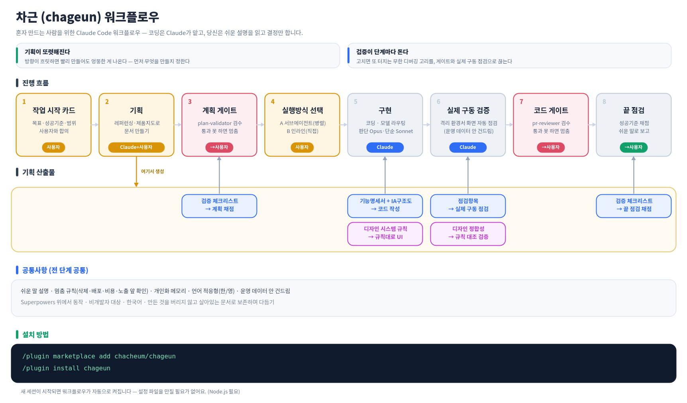

# 차근 (chageun)

*차근차근 — 서두르지 않고 단계별로, 검증하며.*

**혼자 만드는 사람을 위한 Claude Code 워크플로우.**
코딩과 개발 지식은 Claude가 맡습니다. chageun는 옆에서 *방향·검증·일관성*이 무너지지 않게 받쳐줘요 — 당신은 **쉬운 설명을 읽고 결정만** 하면 됩니다.

→ [English](#english) · [한국어](#한국어)



---

## 한국어

### 왜 기획과 검증인가

비개발자의 코딩에서 제일 중요한 건 화려한 기능이 아니라 **기획**과 **검증**입니다.

- **기획이 약하면 — 원하던 것과 다른 게 나옵니다.** 방향이 흐릿하면 Claude가 아무리 빨리 만들어도 엉뚱한 결과가 됩니다. chageun는 레퍼런스 조사·살아있는 기능 명세·화면 구조(IA)로 "뭘 만들지"를 먼저 또렷하게 잡습니다.
- **검증이 약하면 — 무한 디버깅 지옥에 갇힙니다.** A를 고치면 B가 터지고, B를 고치면 C가, C를 고치면 다시 A가… 이 굴레요. chageun는 계획과 코드를 단계마다 적대적으로 검수하고, 코드만 읽는 게 아니라 **격리된 환경에서 화면을 직접 눌러** 확인해 그 고리를 끊습니다.

어려운 말은 필요 없습니다. **코드는 Claude가, 당신은 결정만.** 코드를 못 읽어도 안전장치와 쉬운 설명이 받쳐줍니다.

### 무엇을 해주나

chageun는 [Superpowers](#함께-설치되는-것-중요) 위에 얹혀 **기획 → 게이트 → 구현 → 검증 → 마무리** 흐름 전체를 받칩니다(위 그림).

- **기획** — 레퍼런스 조사, 기능 명세 + 화면 구조(IA)를 살아있는 문서로
- **게이트** — 독립된 심판이 계획·코드를 적대적으로 검수, 통과 못 하면 멈춤
- **구현** — Claude가 코딩 (판단은 똑똑한 모델, 기계적 작업은 빠른 모델로 분담)
- **검증** — 격리 Docker에서 화면을 직접 눌러보는 실제 구동 검증. **운영 데이터는 절대 안 건드림**
- **마무리** — 합의한 성공 기준으로 채점하는 끝 점검
- **항상** — 모든 결과를 쉬운 말로 설명, 위험한 일(삭제·배포·비용·노출) 앞에선 멈춰 확인, 당신의 도메인을 학습

그 위에 **정기 자동 점검 · 보안 스캔 · 디자인 검증**까지 운영 단계도 돕습니다.

<details>
<summary>전체 기능 한눈에</summary>

작업 시작 카드 · 레퍼런싱 · 제품 지도(명세+IA) · 계획 검증 게이트 · 모델 라우팅 · 실제 구동 검증 · 디자인 정합성 · 코드 검증 게이트 · 끝 점검 · 비전문가 요약 · 멈춤 규칙 · 개인화 메모리 · 언어 적응형 · 약속-미실행 가드 · 최소 구현 우선 · 검수·git 안전 · 검증 체크리스트 등뼈 · 정기 자동 점검 · 보안 스캔 · 디자인 검증 사슬
</details>

> **핵심 관점.** chageun는 있는 걸 버리고 스펙에서 재생성하지 않습니다. 당신이 만든 것을 진짜 자산으로 보고, 살아있는 지도와 지속 검증으로 다듬어요. 실제 손님·데이터가 살아있는 일은 원래 이렇게 다뤄야 하고, 그래서 실제 앱을 운영하는 비개발자에게 맞습니다.

### 준비물

- **Node.js** (필수) — Claude Code와 chageun 둘 다 사용. `node -v`로 확인.
- **Docker Desktop** *(또는 로컬 Supabase)* — 백엔드/DB가 있는 앱을 실제 구동 검증할 때만 권장. 격리 환경이라 운영 데이터를 건드리지 않습니다. 정적·DB 없는 앱은 필요 없습니다. [Docker Desktop](https://www.docker.com/products/docker-desktop/)은 직접 설치하세요.

### 설치

```
/plugin marketplace add chacheum/chageun
/plugin install chageun
```

새 세션이 시작되면 워크플로우가 자동으로 켜집니다(설정 파일 편집 불필요). 활성 안내가 안 보이면 아래 "문제 해결"을 보세요.

> **자동 업데이트(선택).** 서드파티 마켓은 기본이 수동 업데이트라, 새 버전은 `/plugin marketplace update chageun`(그다음 `/reload-plugins`)로 받습니다. 공식 플러그인처럼 자동으로 받으려면 직접 켜세요: `/plugin` → Marketplaces → chageun → **Enable auto-update**. 기본 OFF는 의도된 것입니다(서드파티 플러그인이 동의 없이 업데이트를 몰래 밀어 넣지 못하게). chageun는 아직 빠르게 바뀌므로 수동 업데이트가 더 안전한 기본값이에요.

### 함께 설치되는 것 (중요)

이 플러그인은 `claude-plugins-official` 마켓플레이스의 **Superpowers** 방법론 스킬(아이디어 정리·계획·디버깅 등)을 사용합니다.

- Superpowers는 **의존성으로 자동 설치**됩니다(따로 설치하지 않아도 됩니다).
- 자동 설치는 **최신 Claude Code(권장 v2.1.143+)**에서 안정적입니다.
- 자동 설치가 안 됐으면 수동으로(이 순서 그대로):
  ```
  /plugin marketplace add claude-plugins-official
  /plugin install superpowers
  ```
  chageun의 의존성과 **같은 출처**에서 설치해야 버전이 어긋나지 않습니다.

### 문제 해결

- **활성 안내가 안 보인다 / 게이트·스킬이 안 돈다:** 워크플로우가 안 켜진 것입니다. ① Superpowers 설치 확인(위 수동 설치) ② 이 플러그인은 `node`를 쓰므로 `node -v` 확인 ③ 이미 열린 세션은 `/reload-plugins` 하거나 새 세션을 엽니다.

---

## English

### Why planning and verification

For people building alone, the two things that matter most aren't features — they're **planning** and **verification**.

- **Weak planning → you get something other than what you wanted.** When the direction is fuzzy, Claude builds fast but builds the wrong thing. chageun pins down *what to build* first — reference research, a living feature spec, a screen map (IA).
- **Weak verification → you get stuck in infinite debugging.** Fix A and B breaks; fix B and C breaks; fix C and A breaks again. chageun reviews plans and code adversarially at every step, and actually **clicks through your real screens in an isolated environment** to break that loop.

No jargon required. **Claude handles the code; you read plain-language explanations and just decide.**

### What it does

chageun sits on top of Superpowers and steadies the whole flow — **plan → gate → build → verify → wrap** (see the diagram above).

- **Plan** — reference research, a living feature spec + screen map (IA)
- **Gate** — an independent judge reviews plan & code adversarially; blocks until it passes
- **Build** — Claude codes (judgment on a strong model, mechanical work on a fast one)
- **Verify** — clicks real screens in an isolated Docker env; **production writes are hard-blocked**
- **Wrap** — a final check against the success criteria you agreed on
- **Always-on** — plain-language summaries, stop-and-confirm before risky actions (delete·deploy·cost·exposure), learns your domain

Plus **scheduled monitoring · security scans · design verification** for the operating stage.

> **Core stance.** chageun doesn't throw work away and regenerate it from a spec — it treats what you've built as the real asset and refines it with a living map and continuous verification. That's how real, path-dependent work (with live users and data) has to be managed — which is why it fits non-developers shipping real apps.

### Requirements

- **Node.js** (required) — used by both Claude Code and chageun. Check with `node -v`.
- **Docker Desktop** *(or local Supabase)* — only if you want the real run-through on an app with a backend/database. It runs in an isolated environment, so it never touches production data. Static / DB-less apps don't need it.

### Install

```
/plugin marketplace add chacheum/chageun
/plugin install chageun
```

The workflow turns on automatically when a new session starts — no config files to edit. Superpowers is auto-installed as a dependency (works reliably on recent Claude Code, v2.1.143+). If you don't see an activation notice, install Superpowers manually from the same `claude-plugins-official` source, check `node -v`, and run `/reload-plugins`.

> Language-adaptive: the workflow replies in the language you use (defaults to Korean). The source content is Korean; Claude reads it and answers you in your language.

---

## 구성 / Components

- `rules/operating-rules.md` — 워크플로우 본체(세션 시작 시 자동 적용)
- `skills/` — referencing(레퍼런스) · product-map(명세+IA) · design-system(디자인 규칙) · monitoring(정기 점검) · security-scan(보안 스캔)
- `agents/` — plan-validator(계획 게이트) · pr-reviewer(코드 게이트) · code-implementer(기계적 구현)
- `hooks/finish-work.js` — 약속-미실행 차단 훅(Stop hook)

## 라이선스 / License

MIT
